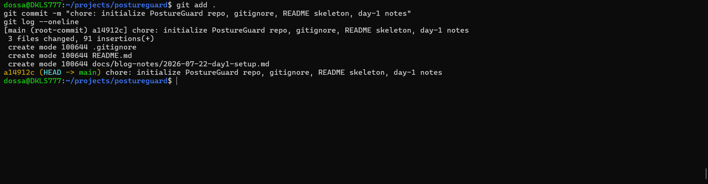
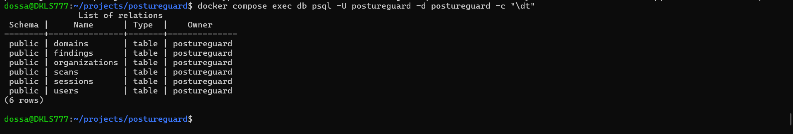
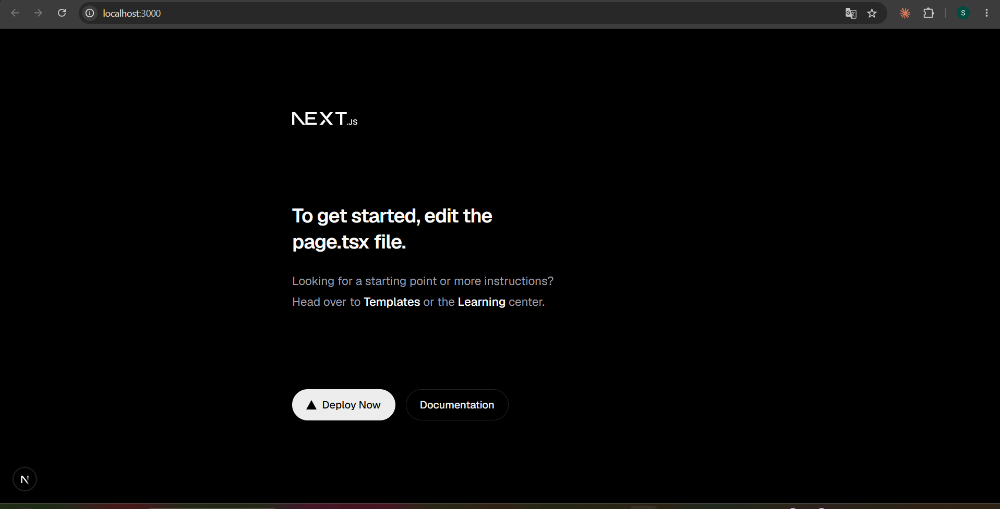
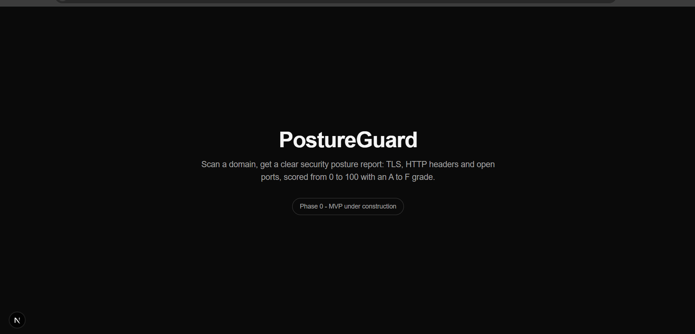

# PostureGuard: build screenshots

A visual, step-by-step log of building PostureGuard. Each screenshot documents a milestone.

## 01. First commit

Initialized the Git repository and made the first commit: .gitignore, README skeleton, and day-1 notes. This is the official start of the project.

## 02. Database schema

PostgreSQL 16 running in Docker. The six core tables (organizations, users, sessions, domains, scans, findings) were auto-created on first boot from the init SQL script. The scans table doubles as a job queue.

## 03. Next.js app running

The Next.js 16 web app boots on localhost:3000 with the default template, confirming the frontend toolchain works.

## 04. PostureGuard landing page

Replaced the default template with a custom PostureGuard landing page, styled with Tailwind CSS.
