# PostureGuard: build screenshots

A visual, step-by-step log of building PostureGuard. Each screenshot documents a milestone.

## 01. First commit

Initialized the Git repository and made the first commit: .gitignore, README skeleton, and day-1 notes. This is the official start of the project.

## 02. Database schema

PostgreSQL 16 running in Docker. The six core tables (organizations, users, sessions, domains, scans, findings) were auto-created on first boot from the init SQL script. The scans table doubles as a job queue.

## 03. Next.js app running

The Next.js 16 web app boots on localhost:3000 with the default template, confirming the frontend toolchain works.

## 04. PostureGuard landing page

Replaced the default template with a custom PostureGuard landing page, styled with Tailwind CSS.

## 05. Sign-up page
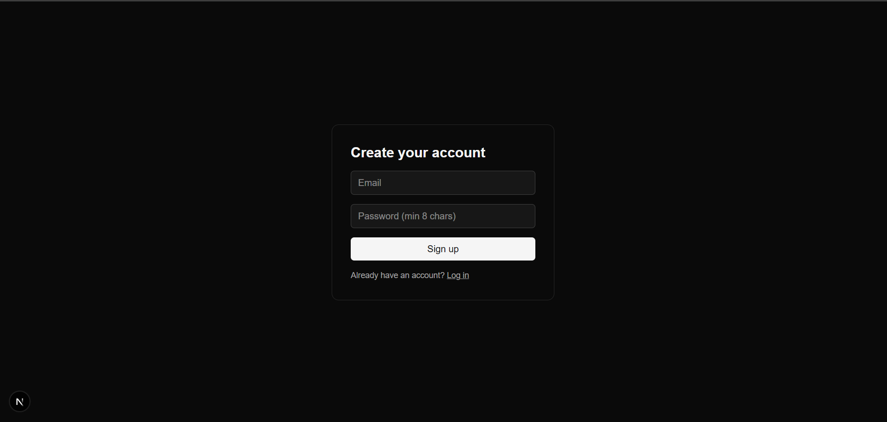

The account creation form (email + password), styled with Tailwind.

## 06. Dashboard (protected)
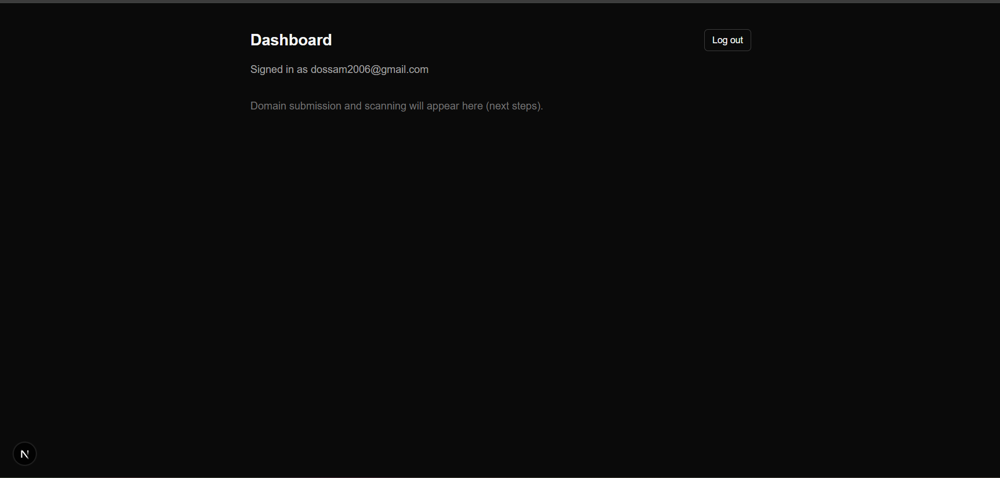

After sign-up or login, the user lands on a protected dashboard. Unauthenticated visitors are redirected to the login page.

## 07. Hashed passwords in the database
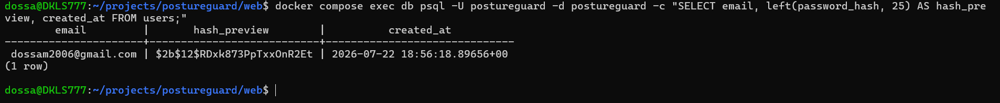

Passwords are never stored in plain text. Each is hashed with bcrypt (cost factor 12), shown here by the "$2b$12$" prefix.

## 08. Domain ownership verification
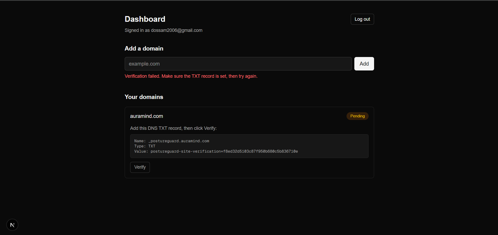

Before scanning, a user must prove they own the domain. PostureGuard issues a unique token to place in a DNS TXT record (_postureguard.<domain>). Verification performs a live DNS lookup and only marks the domain verified if the token is found.

## 09. Scan report
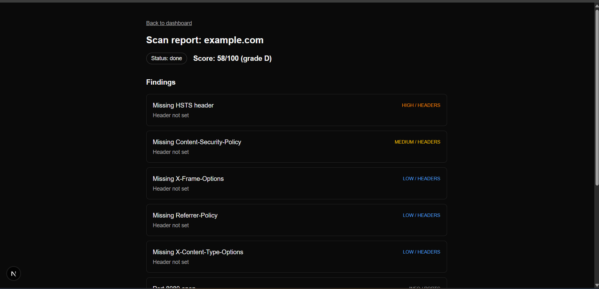

A completed scan for example.com: overall score 58/100 (grade D) with detailed findings across TLS, HTTP headers, and open ports.

## 10. Python worker
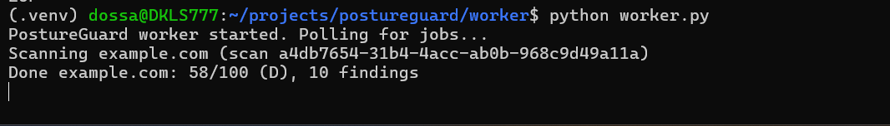

The Python worker polls the scans queue (SKIP LOCKED), runs the three scanners, writes findings, computes the score, and marks the scan done.

## 11. systemd worker service
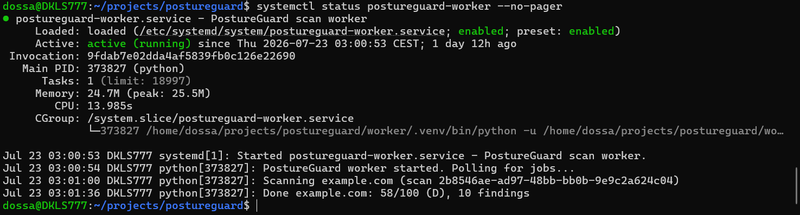

The Python worker runs as a systemd service: it starts automatically on boot, restarts on crash, and its logs are captured by journald.

## 12. Automated database backups
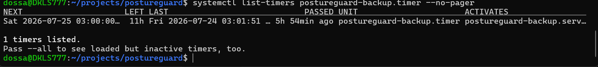

A systemd timer runs a bash backup script daily at 03:00. Each run dumps and gzips the database, then rotates old backups (keeping the last 7). The timer fired on its own after a full machine restart.

## 13. Scoring unit tests
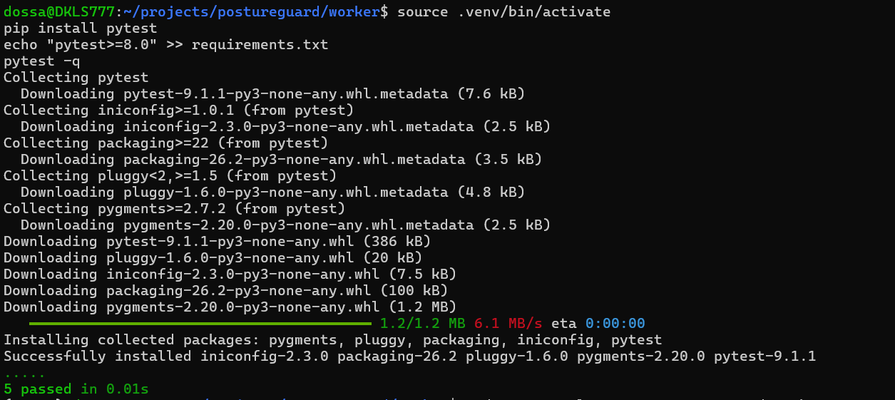

The scoring logic is isolated in a dependency-free module and covered by pytest unit tests: empty scan, single high, single critical, a realistic mixed case, and the zero floor.

## 14. Real domain ownership verified
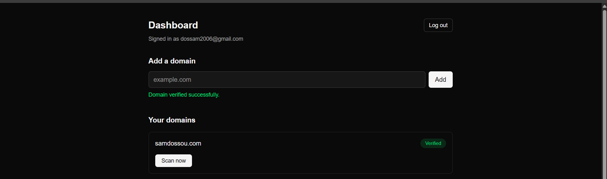

End-to-end ownership verification on a real domain I own (samdossou.com): the app issued a unique token, I added the corresponding DNS TXT record at the registrar (Cloudflare), and the live DNS lookup confirmed it. The badge turned green.

## 15. Azure resource group created from the CLI
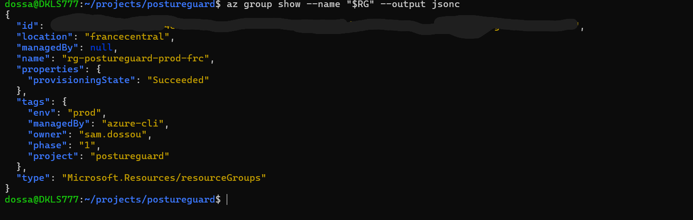
Phase 1 starts in the terminal, not the portal: `az group create` provisions `rg-postureguard-prod-frc` in France Central with the five mandatory tags applied at creation time rather than retrofitted afterwards. Scripting the infrastructure from day one is what makes it cheap to tear everything down between sessions and rebuild it in minutes, and it is the first draft of the Terraform code coming in Phase 4. The output is filtered with `--query` so that no subscription identifier appears in the screenshot.

## 16. Resource group in the Azure portal
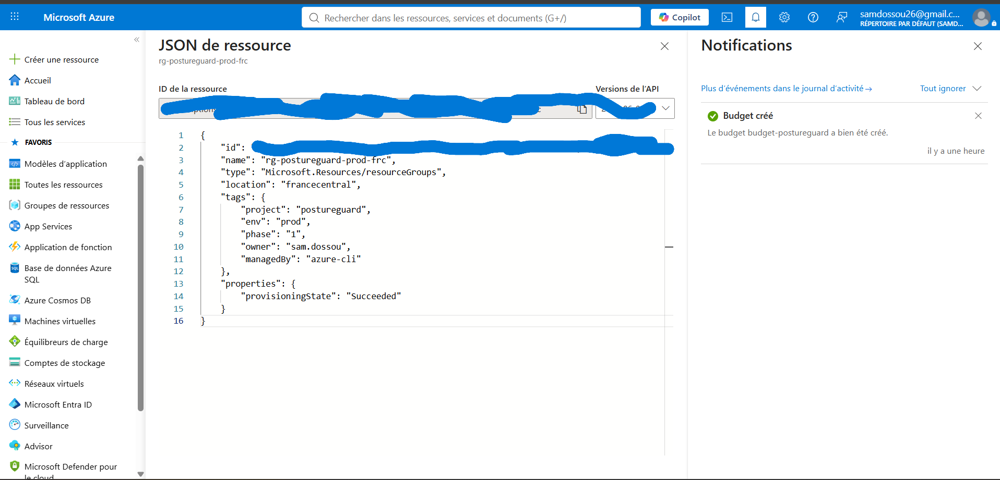
The same resource group seen from the portal. The tags are not cosmetic: Azure Cost Management can break the bill down by `project` and by `phase`, which matters when working against a credit that expires after 30 days. Everything in Phase 1 lives in this single resource group, so a single `az group delete` removes all of it.

## 17. Entra ID security defaults enabled
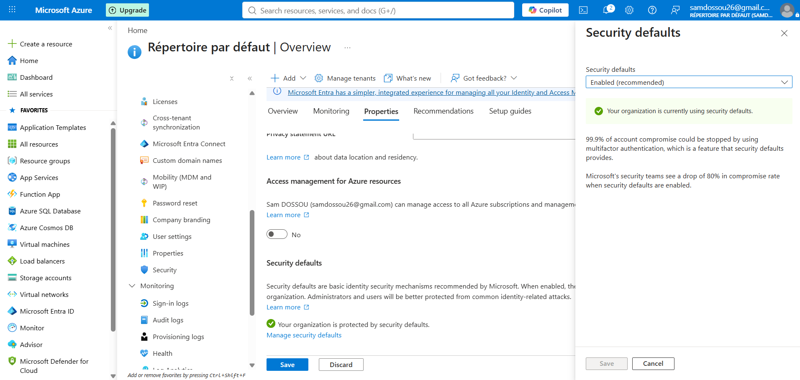
The tenant runs with Entra ID *security defaults* set to *Enabled (recommended)*: MFA is enforced for administrators, legacy authentication protocols are blocked, and privileged actions require re-authentication. It is the free, zero-configuration baseline that closes the most common identity attack paths before any Conditional Access policy is written. The green banner confirms the directory is actively protected.

## 18. Two-step verification on the Microsoft account
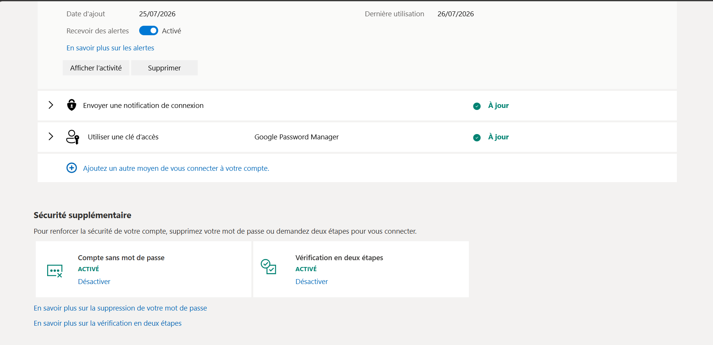
The identity that owns the whole subscription is itself hardened: two-step verification is on, the account is passwordless, sign-in notifications are enabled, and a passkey (via Google Password Manager) is registered and up to date. Securing the cloud resources is pointless if the human account that controls them can be phished. This is the root of the trust chain.

## 19. The ops account is scoped to one resource group
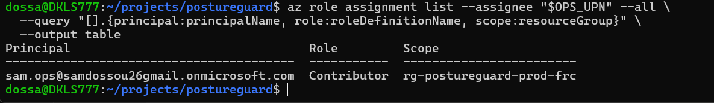
Day-to-day operations use a dedicated account rather than the subscription owner. Its only role assignment is `Contributor` on `rg-postureguard-prod-frc`, so it can manage everything inside the project's resource group and nothing outside it. The blast radius of a compromised ops credential stops at the boundary of a single resource group.

## 20. Proving least privilege by what it cannot do
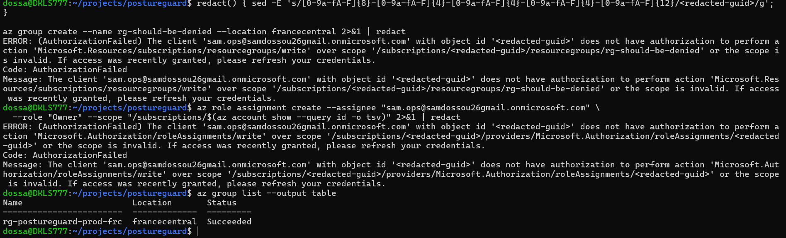
The negative test that makes the previous one meaningful: from the ops account, creating a resource group outside the allowed scope fails with `AuthorizationFailed`, and, crucially, self-assigning the `Owner` role also fails, because granting roles is a separate `Microsoft.Authorization/roleAssignments/write` permission the account does not hold. It can still list its own resource group. Privilege escalation is closed off, and the subscription identifiers are redacted in the output.

## 21. Database password generated straight into Key Vault
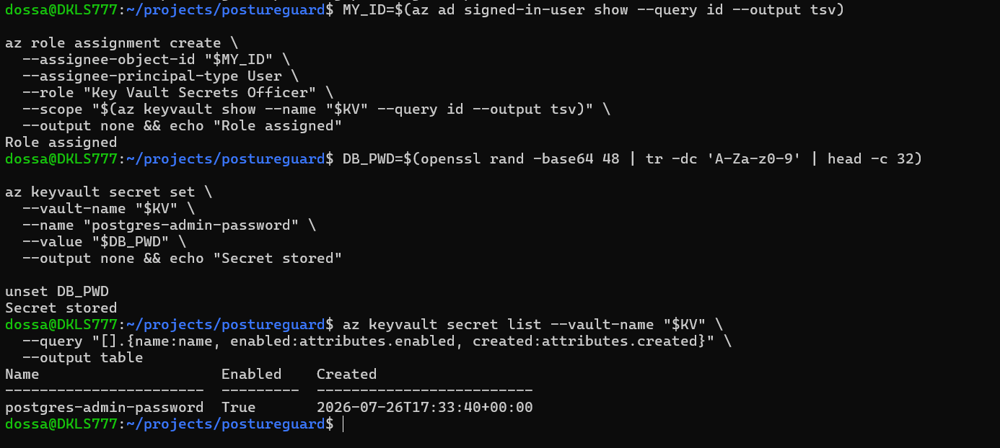
The PostgreSQL admin password is generated with `openssl`, written directly to Azure Key Vault, and unset from the shell. It is never displayed, never written to a file, and never enters shell history. Listing secrets returns metadata only, never values, which is why this command is safe to screenshot. The vault uses RBAC authorisation rather than legacy access policies, and being subscription Owner is deliberately not enough to read it: Azure separates the management plane from the data plane, so a dedicated `Key Vault Secrets Officer` assignment is required.

## 22. Remediating a pinned transitive vulnerability
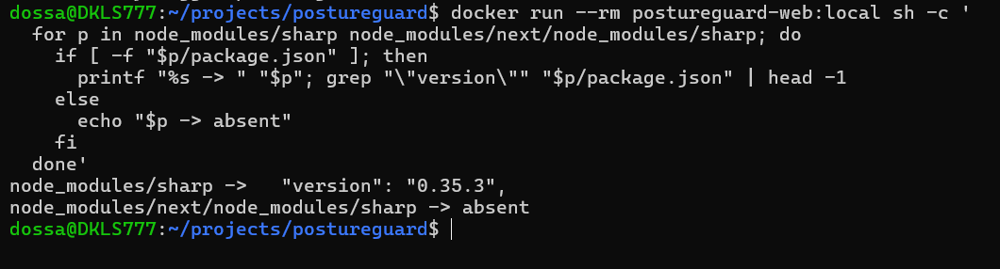
`npm ci` reported 12 high-severity advisories. Inspecting the image showed that nine of them, the eslint chain and postcss, never leave the build stage, and that `sharp 0.34.5` was the only genuinely shipped package, carrying four libvips CVEs. `npm audit fix --force` proposed downgrading Next.js to a 2020 release, so it was rejected. Installing `sharp@latest` merely relocated the vulnerable copy where Node would still resolve to it; the real fix was npm `overrides` with the `"$sharp"` syntax. This screenshot verifies the outcome in the artefact rather than in the audit report.

## 23. Debugging container-to-container networking
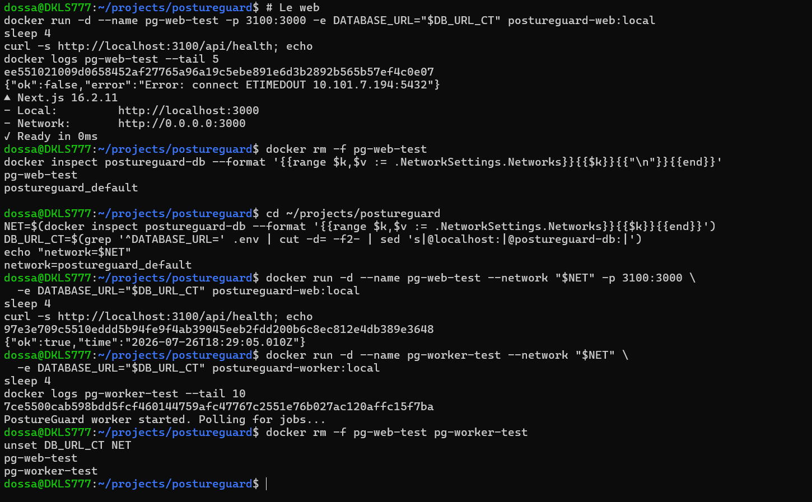
The first test pointed the connection string at `host.docker.internal` and timed out: the database is not a host service, it is another container. Attaching both test containers to the same Docker network and addressing PostgreSQL by its service name worked immediately: the web image returns `{"ok":true}` and the worker starts polling the queue. This is the same model Container Apps uses, where services resolve each other by name; the image never changes, only the injected environment variable does.

## 24. Hardened, minimal images
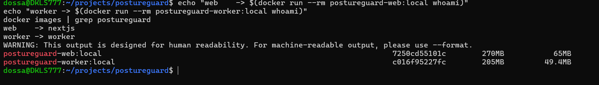
`whoami` returns `nextjs` and `worker` rather than `root` in each image: a container escape from root is an escape to root on the host. The sizes show what the three-stage build buys: 270 MB for the web app instead of roughly 1.2 GB, carrying 24 runtime packages instead of the 386 installed at build time.

## 25. Images published to Azure Container Registry
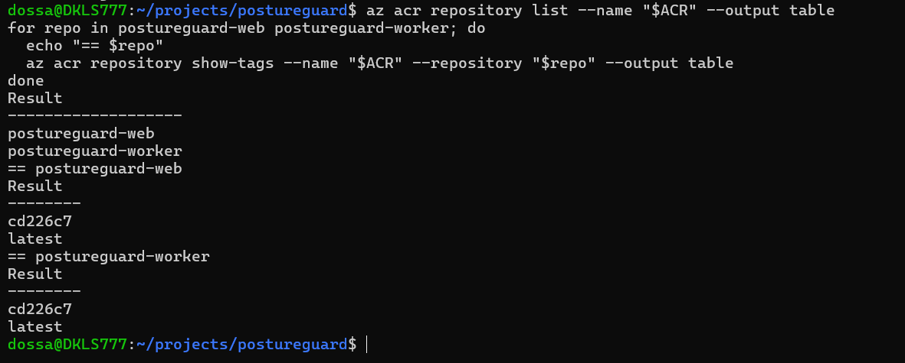
Both images live in `acrpostureguardprod` with two tags each: the short git SHA of the commit that produced them, and `latest`. Deployments will reference the SHA, never `latest`. An immutable tag is what lets you know exactly what is running and roll back with certainty. The registry's admin account is disabled: pushing authenticates with an Entra token via `az acr login`, and pulling will use a managed identity, so no registry password exists anywhere in this project.

## 26. Schema loaded on Azure Database for PostgreSQL
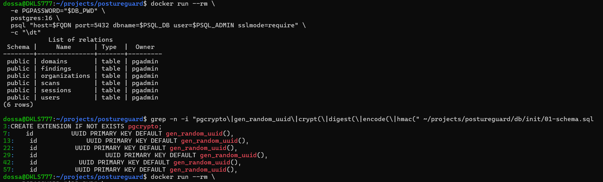
All six tables exist on the managed server, loaded over TLS with `sslmode=require`. The interesting part is the error that is not shown as a failure: `pgcrypto` is not allow-listed on Azure Database for PostgreSQL, and the grep below shows why that did not matter: the extension was only there for `gen_random_uuid()`, which has been part of core PostgreSQL since version 13. Removing the `CREATE EXTENSION` line made the schema portable across any managed PostgreSQL 13+ instead of requiring a server parameter change. A managed-service constraint that simplified the code rather than complicating it.

## 27. A managed identity with exactly two permissions
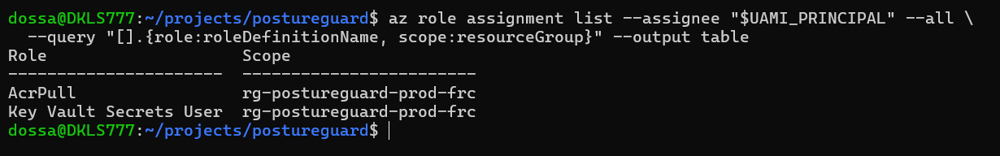
The applications authenticate with a user-assigned managed identity that has no password at all. Azure issues short-lived tokens on demand. It holds `AcrPull`, not `AcrPush`, so it can fetch images but cannot publish them; and `Key Vault Secrets User`, not `Secrets Officer`, so it can read secrets but cannot create or modify them. No credential exists anywhere in this deployment, which means none has to be rotated or protected.

## 28. Secrets referenced, never copied
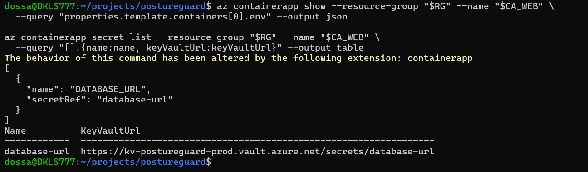
The container's environment shows only `secretRef: database-url`, and the secret itself is a Key Vault reference resolved at startup by the managed identity. The connection string is never stored in the app configuration. An account able to read the application definition still cannot read the database password. Rotating the secret in Key Vault propagates with a restart, without touching the deployment.

## 29. The worker running on Azure
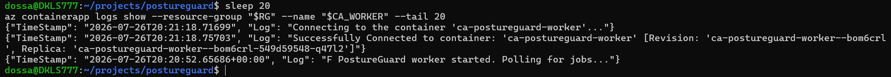
The Python worker runs as a background container app with no ingress and no exposed port, since it only consumes the queue. Exactly one replica: at zero nobody processes scans, and while the `FOR UPDATE ... SKIP LOCKED` pattern from Phase 0 would handle several workers without collision, there is no reason to pay for that yet.

## 30. Custom domain served over HTTPS
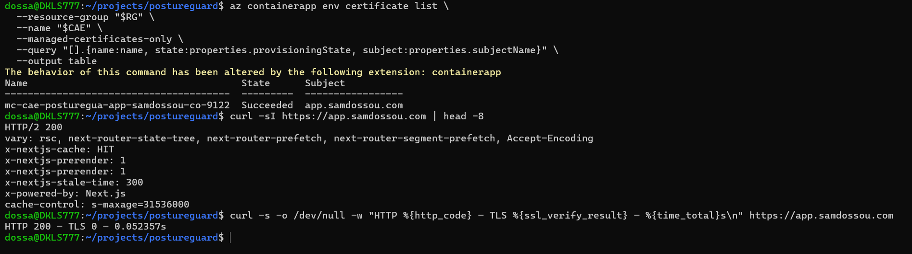
The environment holds an Azure-managed certificate for `app.samdossou.com` in state *Succeeded*. Issuance and renewal are handled by the platform, with no private key to store or rotate. `curl` confirms the result end to end: `HTTP/2 200`, TLS verification passing (`ssl_verify_result: 0`), a full response in around 50 ms, and the Next.js cache reporting a `HIT`. The app is reachable on its own domain, encrypted, with HTTP redirected to HTTPS.

## 31. PostureGuard live in the browser
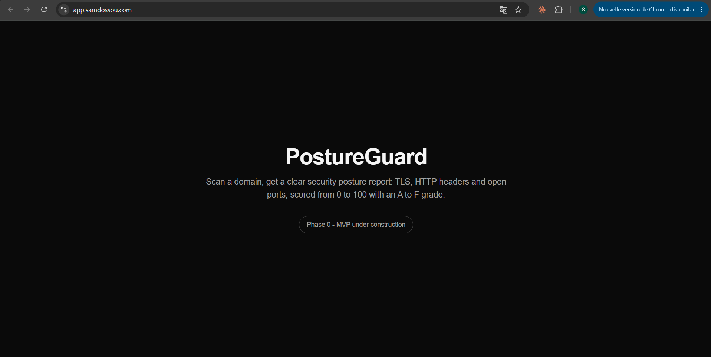
The landing page from screenshot 04, once served from `localhost:3000`, now loads in a real browser at `https://app.samdossou.com`. Same application, running in production on Azure Container Apps behind a managed TLS certificate. From the first local commit to a public, secured URL: the loop is closed.

## 32. Deploying a new revision by image SHA
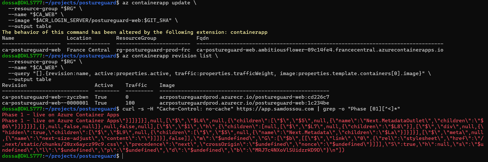
Deployments target an immutable image tag, not `latest`: `az containerapp update` pins the container to `postureguard-web:$GIT_SHA`, and listing the revisions shows each one bound to the exact SHA-tagged image that produced it, with its own traffic weight. Because Container Apps keeps revisions side by side, traffic can be shifted deliberately and rolled back to a known-good revision with certainty. The `curl` at the bottom reads the live site and confirms the deployed content: *Phase 1 - live on Azure Container Apps*.

## 30. Custom domain with a managed TLS certificate

`app.samdossou.com` resolves to the container app through a CNAME, validated by a TXT record under the `asuid` prefix, which is Azure's way of proving domain ownership before letting anyone attach a service to a name they may not control. The certificate is issued and renewed by Azure at no cost. The Cloudflare proxy is deliberately left on "DNS only": with it enabled, Cloudflare terminates TLS and presents its own certificate, which breaks both the initial validation and, more dangerously, the silent renewal months later.

## 31. PostureGuard live on its own domain

The application running on Azure Container Apps, served over HTTPS on its own domain, from an image pulled with a passwordless identity and a connection string read from Key Vault at startup.

## 32. Deploying a new revision, with rollback available

Shipping a change is a cycle: commit, rebuild with the new short SHA as the image tag, push, then `az containerapp update`. Container Apps creates a new revision and shifts traffic to it while keeping the previous one active at zero weight, so rolling back is one `ingress traffic set` command away. This is precisely what `latest` makes impossible: without an immutable tag, there is nothing specific to roll back to.

## 33. Querying the logs found a defect I did not know about
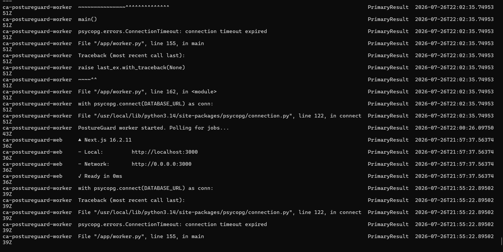
The first KQL query against Log Analytics returned `psycopg.errors.ConnectionTimeout` from the worker, repeating after the database had been stopped. `worker.py` opens a single connection at startup and the process exits if it fails, so the platform restarts it and it fails again. Locally, systemd restarted it exactly the same way, which is why the defect stayed invisible through all of Phase 0: the recovery mechanism hid the fault.

## 34. Finding the anomaly without reading a single line
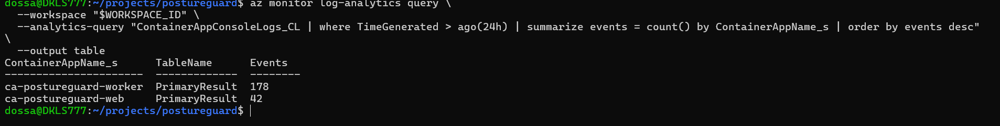
The aggregate query is the one that matters: 178 events from a silent background worker against 42 from the web app actually serving public traffic. The volume asymmetry is the finding, with no log reading required. This is detection reasoning rather than log inspection, and the language is the same KQL that Microsoft Sentinel uses in Phase 3.

## 35. Signed in to the deployed instance
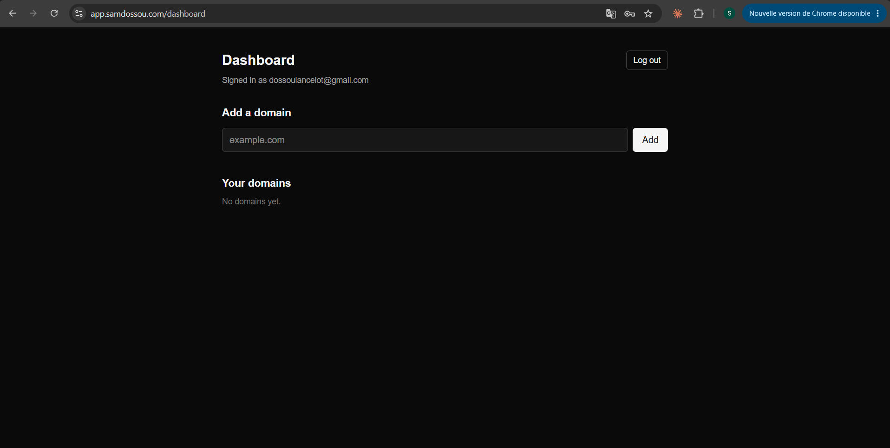
Account created on the live instance at `app.samdossou.com`. The authentication written in Phase 0, with bcrypt hashing, server-side sessions and an httpOnly cookie, now runs against a managed database over TLS rather than a local container.

## 36. Domain ownership verified from Azure
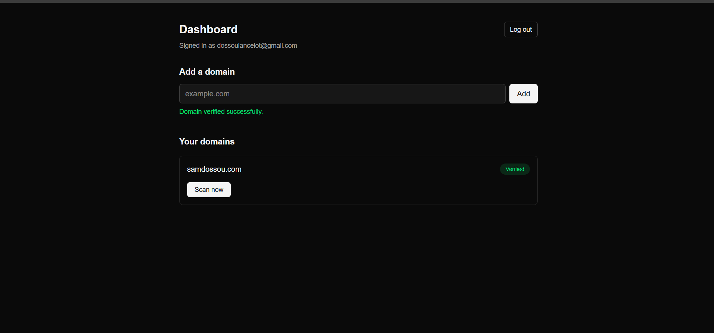
The ownership check ran from a container in France Central against a real DNS TXT record at Cloudflare. Verification before scanning is what keeps the tool from becoming an attack instrument: it only scans what the user can prove they control.

## 37. First end-to-end scan report
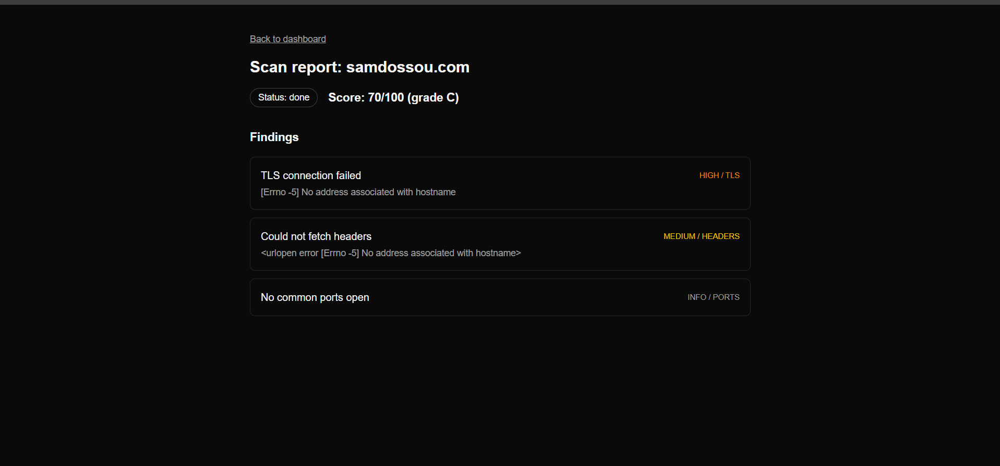
The apex `samdossou.com` scored 70/100 with `No address associated with hostname`, and the scanner was right: the apex has no A, AAAA or CNAME record at all. My own tool found a genuine gap in my own DNS on the day of deployment. It also exposed a scoring flaw: a domain that cannot be reached at all should not land in the same grade band as one that is merely imperfect. "Misconfigured" and "unassessable" are different states.

## 38. The worker processing the job on Azure
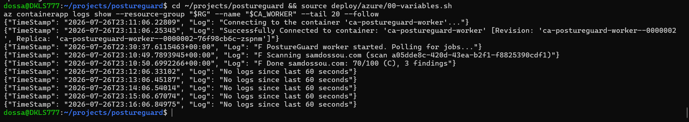
The full chain in one second: the web app inserted a queued scan, the worker picked it up with `FOR UPDATE ... SKIP LOCKED`, ran the three scanners, wrote the findings and computed the grade. The queue-as-database design from Phase 0 works unchanged on Container Apps.

## 39. PostureGuard scanning its own deployment
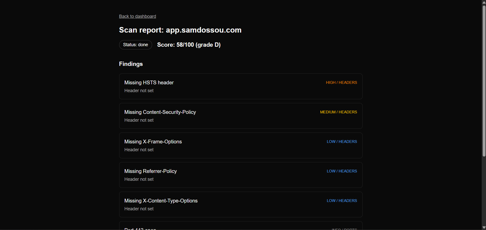
`app.samdossou.com` scored 58/100, grade D. Five missing security headers, HSTS as the high finding. The tool graded its own production deployment and was not generous, which is exactly what it should do. Closing this gap is Phase 2 work, and keeping the D here makes that a measurable before and after.

## 40. What the scan got right
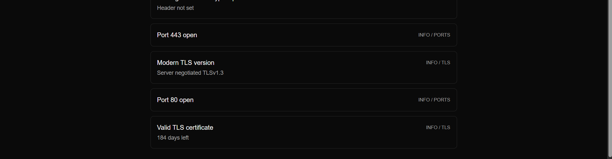
The same report's informational findings: TLS 1.3 negotiated, a valid certificate with 184 days left, ports 80 and 443 open as expected for a web service. The transport layer is sound because Azure manages it; the application layer is where the work remains.
